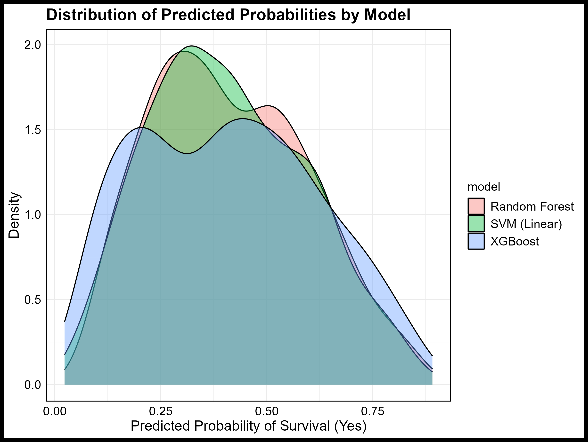
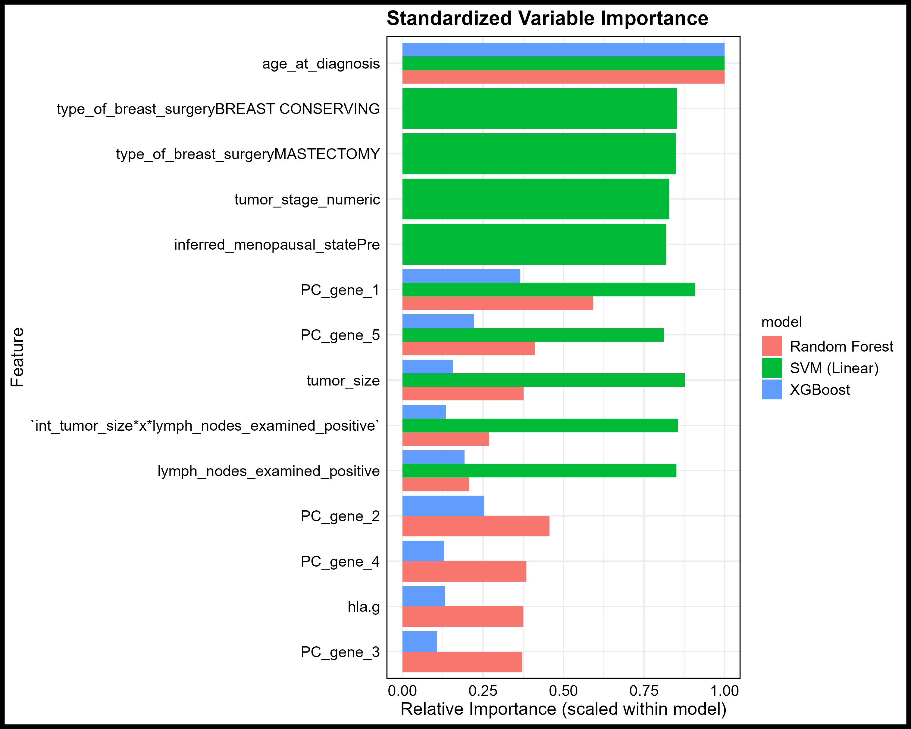

```{r setup, include=FALSE}
knitr::opts_chunk$set(
  echo   = FALSE,
  message = FALSE,
  warning = FALSE,
  fig.width  = 5.5,
  fig.height = 3.6,
  fig.align  = "center"
)

```


Breast cancer survival reflects the combined influence of clinical severity, demographic context, and underlying genomic structure. Predictive modeling in this domain requires methods capable of handling heterogeneous variable types, extensive missingness, strong correlations among tumor severity markers, and a genomic block composed of hundreds of extremely sparse mutation indicators. The METABRIC cohort, which contains more than 1,900 patients and nearly 700 baseline variables, provides a setting in which these challenges appear simultaneously. Exploratory analysis revealed moderate outcome imbalance, substantial missingness in tumor stage, nontrivial missingness in histologic grade and tumor size, and widespread sparsity among gene mutation indicators. Strong correlation among tumor size, lymph node involvement, Nottingham Prognostic Index, and histologic grade demonstrated that these features represented overlapping manifestations of disease burden.

These data characteristics enabled a preprocessing pipeline emphasizing rigorous data cleaning, explicit handling of missing values, removal of extreme outliers in clinical predictors, rare level merging for categorical variables, median imputation for numeric variables, near-zero variance filtering, dimensionality reduction of sparse mutation indicators through principal component analysis, and a focused set of clinically informed interaction terms. While earlier stages of feature construction produced a larger set of engineered predictors, the final refined design matrix consisted of approximately 28 predictors that combined cleaned clinical variables, a small set of mutation-derived principal components, and only the most meaningful clinically grounded interactions. The aim of this process was not simply to shrink the dataset, but to produce a feature space that allowed statistical models to reflect the biological structure of breast cancer rather than the irregularities and noise present in raw clinical and genomic measurements.

Three machine learning models, which were a linear support vector machine, a Random Forest, and XGBoost, were trained using a stratified 70-30 split and repeated 5 fold cross-validation with AUC as the tuning metric. Models were evaluated using accuracy, ROC- AUC, macro F1, predicted probability distributions, and calibration. XGBoost yielded the strongest ranking ability, Random Forest achieved the most balanced performance across outcome classes, and the linear SVM produced the most stable and conservative calibration. Across models, age at diagnosis consistently emerged as the dominant predictor, while mutation-derived components captured genomic variation not reflected in clinical severity markers. The variation in models highlights the importance of preprocessing decisions, dimensionality reduction, and clinically informed feature engineering for effective modeling of breast cancer survival using METABRIC.

Introduction

Breast cancer survival emerges from biological processes operating across clinical, demographic, and genomic levels. Tumor burden, proliferation dynamics, lymphatic involvement, treatment history, and underlying genomic instability all shape survival probability. These processes do not act independently; age modifies tumor biology, tumor biology modifies treatment response, and genomic alterations influence whether tumors follow more or less aggressive growth trajectories. This interdependence highlights why methods that can only model isolated linear effects often fail to represent the full biological landscape. Machine learning methods are increasingly used to model these interactions because they can integrate large numbers of clinical features with high-dimensional genomic measurements and capture nonlinear, conditional, and threshold-based effects that more restrictive statistical models cannot represent. The METABRIC cohort, which includes extensive clinical information alongside several hundred binary mutation indicators, provides a particularly rich environment for assessing how models interpret the joint clinical genomic structure of breast cancer. The dataset captures many elements of contemporary oncology practice, including tumor morphology, detailed staging components, hormone receptor information, lymphatic spread, and patient demographics. The genomic block adds another layer, representing the presence or absence of somatic mutations that may influence tumor behavior through pathway dysregulation, replication stress, and DNA repair deficiencies. These genomic indicators are extremely sparse because many mutations occur in only a small fraction of tumors, reflecting the biological reality that breast cancer is driven by a limited number of common pathways and a much larger set of rare or private mutations.

The subset used in this study included 1,904 patients with complete overall survival status and survival time. Survival status was treated as a binary endpoint representing whether the patient was alive at the last follow-up. The initial set of nearly 700 predictors included clinical, demographic, histologic, and surgical variables, along with several hundred mutation indicators derived from tumor sequencing. Clinical variables such as tumor size, lymph nodes examined positively, Nottingham Prognostic Index, histologic grade, age at diagnosis, and tumor stage capture different dimensions of disease burden and aggressiveness. However, these variables overlap substantially, as they are all downstream reflections of tumor progression. The mutation indicators provide a high-dimensional but sparse representation of genomic alterations that can signal instability, pathway disruption, and distinct tumor phenotypes. Their relationship with survival is more subtle and often interacts with clinical severity rather than acting as isolated predictors. Exploratory analysis revealed structural challenges that strongly influenced the modeling strategy. Tumor stage had the highest missingness, with more than a quarter of patients missing stage information entirely. Histologic grade and tumor size showed moderate but meaningful missingness. The mutation block was characterized by extreme sparsity, with most mutation indicators having very low prevalence. Correlation heatmaps confirmed substantial overlap among traditional severity variables such as tumor size, lymph node involvement, Nottingham Prognostic Index, and histologic grade. These correlations reflect the shared biological processes underlying tumor progression and staging. Genomic indicators, in contrast, showed little correlation with clinical variables, suggesting they represented an independent dimension of risk. The need to capture both shared clinical structure and independent genomic structure motivated a pipeline that approached these domains differently, rather than forcing them into a uniform preprocessing framework.

These properties required a modeling approach that balanced dimensionality reduction, stability, and biological interpretability. Without careful preprocessing, missingness could bias estimates, sparsity could distort model structure, and correlated clinical predictors could produce unstable decision boundaries. The goal of the study was therefore to build a predictive modeling pipeline anchored in exploratory findings, designed to reduce noise and redundancy, and capable of integrating both clinical severity and genomic structure. The resulting analysis aimed not only to compare model performance but also to explain how different model architectures interpret breast cancer risk patterns in the METABRIC dataset.

Methodology

The analysis modeled overall survival status as a binary endpoint. After removing patients with missing survival information, the cohort contained 1,904 complete cases. Predictors that directly encoded outcome information, such as survival time and death-related variables, were removed to prevent leakage. The remaining predictors consisted of clinical variables, demographic variables, and several hundred mutation indicators. Preprocessing emphasized stability and reduction of noise. Categorical variables were cleaned, recoded, and assigned explicit missing levels. Rare categories were collapsed to avoid fragmentation and rank deficiency. Numeric clinical variables were inspected for skewness, irregular distributions, and extreme values. Outliers in tumor size, lymph nodes examined positive, and other continuous predictors were removed because exploratory visualization demonstrated that extreme values disturbed model boundaries and inflated variance. These extreme values were rare and biologically implausible, suggesting errors in reporting or transcription rather than meaningful clinical signals.

Missing numeric values were imputed with the median, applied strictly within the training set to avoid leakage. Near-zero variance predictors were eliminated, particularly within the mutation block, where many genes showed little to no activity. Several clinically meaningful predictors, such as tumor stage, Nottingham Prognostic Index, and histologic grade, were excluded despite their biological relevance. The tumor stage exhibited substantial missingness that made imputation unreliable. Histologic grade and the Nottingham Index showed almost perfect collinearity with tumor size and lymph node burden, which destabilized decision surfaces and produced highly redundant representations of severity. Diagnostic evaluations revealed that retaining these variables yielded no measurable improvement once outlier removal and interaction filtering established a more compact severity representation. To incorporate genomic structure without replicating the sparsity of the mutation matrix, principal component analysis was applied to the filtered mutation indicators. Only a small set of components explaining meaningful variation was retained. A reduced group of clinically motivated interactions was also included, reflecting risk amplification patterns observed during exploratory analysis. After integrating these elements, the final predictor matrix consisted of approximately twenty-eight variables.

Evaluation

Evaluation of the three models revealed not only differences in predictive performance but also important distinctions in how each statistical method interacted with the clinical and genomic structure of the METABRIC dataset. Although the SVM, Random Forest, and XGBoost achieved broadly similar numerical metrics, the underlying reasons for these results reflected the models assumptions rather than simple numerical differences. The linear SVM reached an accuracy of 0.6976, an AUC of approximately 0.7554, and a macro F1 of 0.6800. Random Forest reached an accuracy of 0.7086, an AUC of 0.7669, and a macro F1 of about 0.6950. XGBoost showed accuracy around 0.7031 and an AUC of 0.7653, with a macro F1 slightly lower than Random Forest. Although these differences appear numerically modest, their meaning becomes clearer when interpreted in the context of METABRIC. Breast cancer severity does not change smoothly across predictors, even for classical variables such as tumor size or lymph nodes examined positively. These clinical features reflect biological processes that often produce abrupt changes in risk, such as when additional lymphatic involvement signifies a transition into more aggressive disease. A linear SVM can approximate these patterns only by stretching its single separating boundary. Even with clinically informed interactions, it cannot fully express conditional changes where genomic structure modifies the effect of tumor burden. This explains why the SVM produced the most compressed predicted probability distributions and the most conservative calibration. The model is designed to produce globally monotonic risk assignments, so it smooths away some of the nonlinear clinical structure that METABRIC contains.

Random Forest differed because its recursive partitions align more naturally with biological thresholds. Its slightly higher accuracy and macro F1 reflect the fact that decision trees capture survival changes that occur only once clinical severity crosses certain boundaries, such as the jump in risk associated with higher lymphatic spread. The ensemble nature of the forest allowed it to approximate many alternative clinical pathways at once, which is useful in a cohort where tumor progression, hormone receptor differences, and age-related risk operate simultaneously. However, the piecewise nature of tree-based probabilities also produced a stepwise calibration pattern and the multimodal distribution of predicted probabilities, which is typical of tree ensembles. XGBoost achieved similar discrimination to Random Forest but through a mechanism that better amplifies subtle genomic and clinical discordances. Boosting concentrates learning on the patients who deviate from standard severity rules. These borderline cases often correspond to biologically distinct tumor subtypes that exhibit unique genomic signatures. As a result, XGBoost captured fine-grained heterogeneity that the other models tended to smooth over. This produced sharper probability assignments in certain regions of the predictor space and slightly less stable calibration in others. Taken together, the evaluation metrics show that the assumptions of each model shaped its interpretation of the dataset. The SVM emphasized global severity trends, Random Forest emphasized clinical thresholds, and XGBoost emphasized localized genomic clinical deviations. These differences help explain why all three models reached similar AUC values yet displayed distinct predicted probability behaviors reflective of the biological complexity of METABRIC.


```{r prob_distributions, fig.align='center', out.width='60%', fig.asp=0.6}

```

```{r variable_importance, fig.align='center', out.width='60%', fig.asp=0.6}

```
Discussion

The comparative behavior of the models reveals how various assumptions interact with the biological and clinical structure of breast cancer. Although age at diagnosis, tumor size, and lymph node involvement remained dominant predictors across all models, each method integrated these variables differently, highlighting how modeling frameworks shape biological interpretation. These predictors dominate because they capture broad physiological processes that govern tumor growth, metastatic potential, immune system decline, and treatment limitations. Their stability and completeness in METABRIC further reinforced their influence across all learning methods. The linear SVM demonstrates how a strong bias toward global linear structure shapes the representation of clinical severity. The model treats the increase in tumor burden or age as producing uniform changes in risk across all patients. Clinically, however, risk escalation is not uniform; it depends on tumor biology, patient age, proliferation patterns, and genomic instability. When the effect of tumor size depends on genomic context, a linear surface can only approximate this interaction in an averaged way. The consequence is a stable but biologically conservative set of predictions. The SVM reflects the major clinical gradients but cannot fully represent subtypes or nuanced genomic effects that deviate from classical staging.

Random Forest approached the problem differently. Its recursive partitioning mirrors clinical decision processes that often rely on threshold-based rules. In oncology, a small change in lymph node burden can move a patient from one prognostic group to another. A slight increase in tumor size may not matter unless combined with certain receptor statuses or age groups. The tree structure naturally approximates these biological thresholds and therefore identifies clinically meaningful subgroups. This allows Random Forest to represent heterogeneity across intermediate risk regions more clearly than the SVM. Yet the probability surfaces it produces remain coarse because they are averages of many discrete leaf estimates, meaning gradual biological influences, such as slow accumulations of genomic instability, may be represented less precisely. XGBoost amplifies biological signals that deviate from standard severity markers. Its iterative focus on misclassified patients directs learning toward genomic clinical combinations that produce survival outcomes that are unexpected from classical features alone. Many tumors in METABRIC exhibit genomic patterns that modify prognosis independently of tumor size or lymphatic spread. XGBoost detects these subtypes by emphasizing residual errors, creating fine distinctions between patients who appear clinically similar but differ genetically. This makes the model more sensitive to biologically meaningful heterogeneity but also increases the sharpness of its probability surfaces, which can reduce calibration stability.

Overall, the results show that survival in METABRIC is shaped by both broad severity gradients and localized genomic variation. The SVM captures the former, Random Forest captures threshold-driven clinical structure, and XGBoost captures deviations driven by genomic signatures. Their convergence on dominant predictors confirms the biology of breast cancer, while their divergence in probability behavior reveals complementary aspects of disease progression. These differences suggest that future work could integrate ensemble learning, investigate nonlinear clinical interactions more fully, or incorporate more sophisticated genomic summarization methods to improve the representation of tumor biology.

